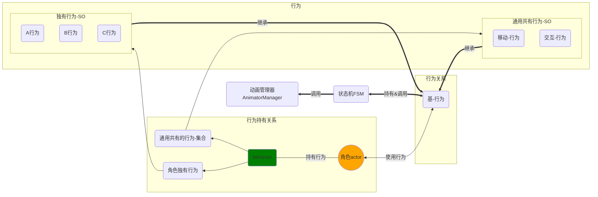

# Actor 与 Behavior 关系图

被存储到 SO 的行为可以针对不同种类的角色进行配置。

- 举例：
  - 主角-行为：
    1. 共有行为->移动、跳跃、攻击、交互
    2. 独有行为->主角行为（单独配置）
  - 敌人：
    - 吸血鬼-行为：
      - 共有行为->移动、跳跃、攻击、追逐（追踪式移动）
      - 独有行为->吸血鬼行为（吸血、通过吸血回血、等）

---

