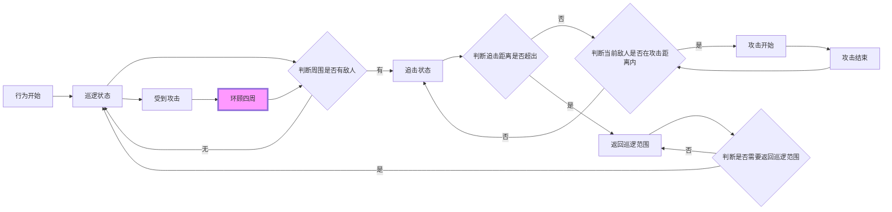

# 行为树基本结构

## 简易的 FSM 转换到行为树 Example

- 这里的攻击未将其列为一种状态，而是一种行为，行为有开始和结束（包括一系列的动画、检测的 trigger 状态、音效、特效以及其他的效果），攻击行为结束后，会自动切换到下一个行为（可能是疲惫、防御、再攻击、等待攻击 CD 的 idle 等）

```mermaid
graph LR
begin[行为开始]
judgeEnemy{判断周围是否有敌人}
judgeAttackDistance{判断当前敌人是否在攻击距离内}
judgeChaseDistance{判断追击距离是否超出}
judgeReturnToPatrol{判断是否需要返回巡逻范围}
patrol[巡逻状态]
return[返回巡逻范围]
chase[追击状态]
attackBegin[攻击开始]
attackEnd[攻击结束]
underAttack[受到攻击]
lookAround[环顾四周]

style lookAround fill:#f9f,stroke-width:4px

begin-->patrol-->judgeEnemy
judgeEnemy-->|无|patrol
judgeEnemy-->|有|chase

chase-->judgeChaseDistance

judgeAttackDistance-->|否|chase
judgeAttackDistance-->|是|attackBegin-->attackEnd-->judgeAttackDistance

judgeChaseDistance-->|否|judgeAttackDistance
judgeChaseDistance-->|是|return-->judgeReturnToPatrol
judgeReturnToPatrol-->|否|return
judgeReturnToPatrol-->|是|patrol

patrol-->underAttack-->lookAround-->judgeEnemy
```
