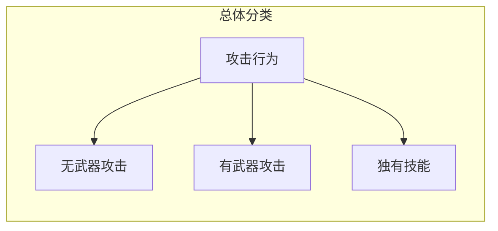

# 攻击行为的子分类

```mermaid
graph LR
attack[攻击行为]
attack_type_no_weapon[无武器攻击]
attack_type_with_weapon[有武器攻击]
attack_type_unique_skill[独有技能]
subgraph 总体分类
attack-->attack_type_no_weapon
attack-->attack_type_with_weapon
attack-->attack_type_unique_skill
end
```
