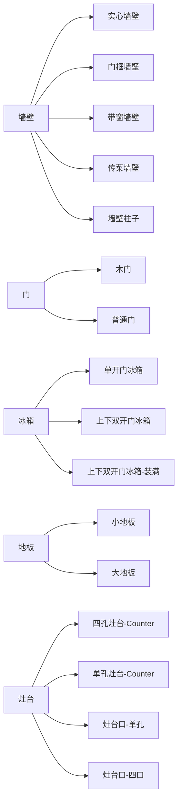
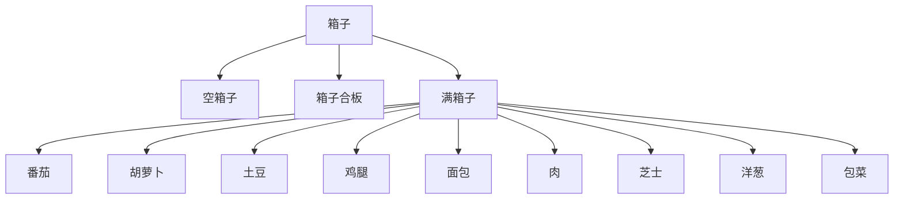

# 餐厅小游戏-素材完备性

## 素材列表

### 人物模型、骨骼

使用 Synty 的 Mini City Character，有骨骼，无动画。

### 餐厅模型

```mermaid
graph LR
墙壁-->实心墙壁 & 门框墙壁 & 带窗墙壁 & 传菜墙壁 & 墙壁柱子
门-->木门 & 普通门
冰箱-->单开门冰箱 & 上下双开门冰箱 & 上下双开门冰箱-装满
地板-->小地板 & 大地板
灶台-->四孔灶台-Counter & 单孔灶台-Counter & 灶台口-单孔 & 灶台口-四口
```

```mermaid
graph TD
箱子-->空箱子 & 箱子合板 & 满箱子
满箱子--> 番茄 & 胡萝卜 & 土豆 & 鸡腿 & 面包 & 肉 & 芝士 & 洋葱 & 包菜
```
